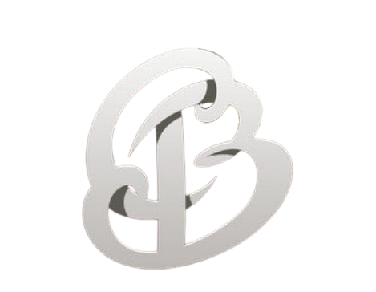

<div align="center">



# FSWD·LAB

### _Full Stack Web Development: a lab journal, built in public._

From a first `<div>` to a working e-commerce store, every lab lives here and runs in the browser.

[](https://codeBilal-exe.github.io/FSWD-LAB/)
[](#-the-labs)
[](https://getbootstrap.com)
[](#)

[**Open the Portal**](https://codeBilal-exe.github.io/FSWD-LAB/) · [**Browse the Labs**](#-the-labs) · [**Featured: Frostline Store**](#-featured-frostline-winter-jacket-store)

</div>

---

## ✦ About

This repository collects my **Full Stack Web Development** lab work in one place. It has a **live portal** that finds every task on its own and lets you open the running page and read its source side by side.

|                |                                         |
| -------------- | --------------------------------------- |
| 🎓 **Course**  | Full Stack Web Development (FSWD)       |
| 🧑‍💻 **Author**  | Muhammad Bilal                          |
| 🛠 **Stack**   | HTML5 · CSS3 · JavaScript · Bootstrap 5 |
| 🌐 **Hosting** | GitHub Pages                            |

---

## ✦ The Portal

The root [`index.html`](index.html) is a small site that drills down in three levels:

```text
 Home            ──▶   Lab page          ──▶   Task page
 one card per lab      one card per task       live preview + source inspector
```

- **Auto-discovery:** the portal reads the repo tree from the GitHub API, so new folders show up without editing any markup.
- **Source inspector:** every HTML, CSS and JS file of a task is listed and syntax-highlighted with highlight.js.
- **Light and dark themes:** an obsidian and champagne-gold dark mode, plus a light mode.
- **Multi-page tasks, one card:** a task folder with many pages gets a single card that opens `index.html`.

---

## ✦ The Labs

### 🧮 Lab 1: Foundations

| Task                    | What it is                                | Tech            |
| ----------------------- | ----------------------------------------- | --------------- |
| [Calculator UI](LAB-1/) | A working calculator with a styled keypad | HTML · CSS · JS |

### 🎨 Lab 2: Layout and Design

| Task                                                 | What it is                                     | Tech       |
| ---------------------------------------------------- | ---------------------------------------------- | ---------- |
| [Class Timetable](LAB-2/Task-1_TIMETABLE/)           | Weekly timetable laid out in a table           | HTML · CSS |
| [Facebook Home](LAB-2/Task-2_FACEBOOK/)              | Pixel-minded clone of the Facebook home screen | HTML · CSS |
| [Portfolio](LAB-2/Task-3_PORTFOLIO/)                 | Personal portfolio site                        | HTML · CSS |
| [Custom UI: Classroom Next](LAB-2/Task-4_CUSTOM_UI/) | A semester dashboard concept                   | HTML · CSS |
| [IEEE Paper Template](LAB-2/Task-5_IEEE_PAPER/)      | Two-column IEEE-style paper layout             | HTML · CSS |

### 🚀 Lab 3: Bootstrap

| Task                                                         | What it is                                                        | Tech             |
| ------------------------------------------------------------ | ----------------------------------------------------------------- | ---------------- |
| [Bootstrap Redo of Lab 2](LAB-3/Task-1_BOOTSTRAP_REDO_LAB2/) | All five Lab 2 tasks rebuilt with Bootstrap's grid and components | Bootstrap 5      |
| [**E-commerce UI**](LAB-3/Task-2_ECOMMERCE_UI/)              | A full store front end: signup to checkout                        | Bootstrap 5 · JS |

---

## ❄ Featured: Frostline (Winter Jacket Store)

The Lab 3 capstone is **Frostline**, a complete e-commerce front end for a winter jacket brand. It needs no backend: the cart, account and reviews are stored with `localStorage`.

**Pages:** `index` · `shop` · `product` · `signup` · `login` · `reviews` · `cart` · `checkout`

| Feature                   | Details                                                          |
| ------------------------- | ---------------------------------------------------------------- |
| 🏔 **Hero section**       | Full-width snowy mountain photo with a gradient overlay          |
| 🧥 **Product listing**    | 8 jackets with live search, category filter and sorting          |
| 🔍 **Product page**       | Size and quantity pickers, ratings, a toast after adding to cart |
| 🛍 **Cart**               | Add, edit quantities with +/−, remove, live totals               |
| 🏷 **Promo and shipping** | Code `WINTER10` gives 10% off, and shipping is free over $150    |
| ✅ **Checkout**           | Validated shipping and payment form, then an order confirmation  |
| 🔐 **Signup and login**   | Bootstrap validation, password match, session-aware navbar       |
| ⭐ **Reviews**            | Average rating, seed reviews, and a form that saves new ones     |

**Demo flow:** browse jackets → add to bag → try `WINTER10` in the cart → check out.

---

## ✦ Project Structure

```text
FSWD-LAB/
├── index.html                       # Lab portal (auto-discovers everything below)
├── favicon.png                      # The "B" monogram
├── README.md
│
├── LAB-1/                           # Calculator UI
│   ├── L1-calculator.html
│   ├── L1-calculator-style.css
│   └── calculato-fun.js
│
├── LAB-2/                           # Plain HTML and CSS
│   ├── Task-1_TIMETABLE/
│   ├── Task-2_FACEBOOK/
│   ├── Task-3_PORTFOLIO/
│   ├── Task-4_CUSTOM_UI/
│   └── Task-5_IEEE_PAPER/
│
└── LAB-3/                           # Bootstrap 5
    ├── Task-1_BOOTSTRAP_REDO_LAB2/  # Lab 2 rebuilt with Bootstrap
    │   ├── shared.css
    │   └── Task-1 … Task-5/index.html
    └── Task-2_ECOMMERCE_UI/         # Frostline store
        ├── index.html   shop.html   product.html
        ├── login.html   signup.html reviews.html
        ├── cart.html    checkout.html
        ├── store.css                # Theme and components
        └── store.js                 # Products, cart, navbar, footer
```

---

## ✦ Run It Locally

```bash
# 1. Clone
git clone https://github.com/codeBilal-exe/FSWD-LAB.git
cd FSWD-LAB

# 2. Serve it (the portal needs a web server, not file://)
python -m http.server 8000
# then open http://localhost:8000
```

Individual tasks, such as the store, can also be opened by double-clicking their `index.html`. Only the **portal's auto-discovery** needs a server.

---

## ✦ Add a New Task

1. Create `LAB-<number>/Task-<number>_<NAME>/`.
2. Put the task's pages and assets inside, with an `index.html` as the entry page.
3. Commit and push to `main`.

The portal picks it up the next time it loads, and no card markup is needed. If you fork this repo, update the `REPO` and `BRANCH` constants near the bottom of the root `index.html`.

> **Note:** a folder with several HTML files is treated as **one** task. The portal previews `index.html` when it exists, otherwise the first page it finds.

---

## ✦ Tech and Credits

- [Bootstrap 5.3](https://getbootstrap.com): layout, components and form validation
- [highlight.js](https://highlightjs.org): the source inspector
- [Google Fonts](https://fonts.google.com): Outfit, Inter, JetBrains Mono, Cinzel Decorative
- Product photography in the store demo: [Unsplash](https://unsplash.com)

---

<div align="center">

**Built lab by lab by [Muhammad Bilal](https://github.com/codeBilal-exe)**


_If this helped you, a ⭐ is always appreciated._

</div>
